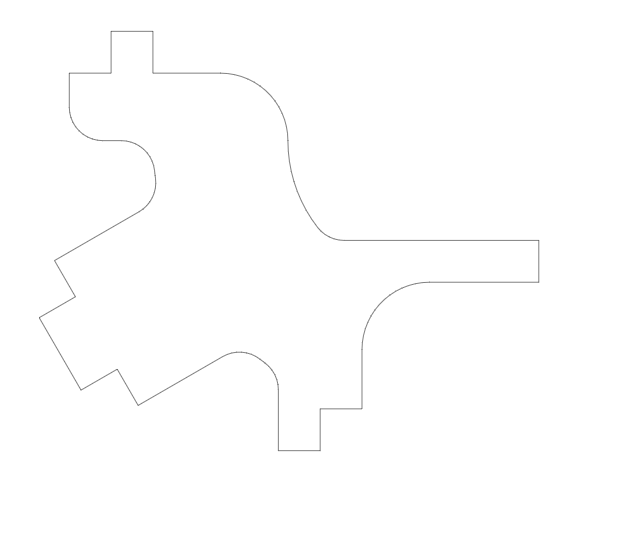
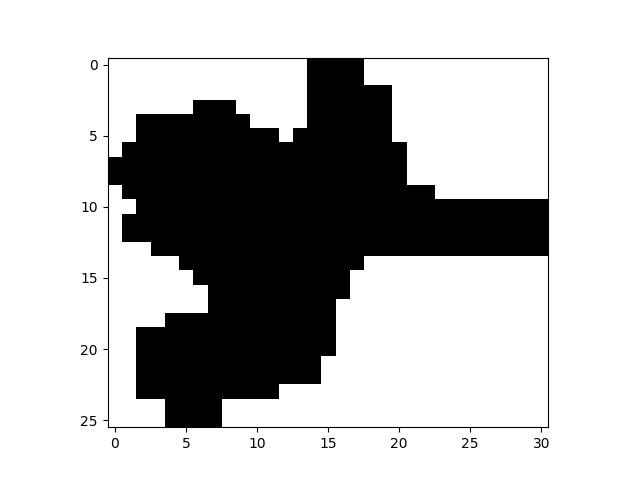
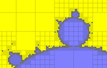

# Report

_As in Update 2, things work; they do not work well_

### Stones Left Unturned

I never got around to the _farm_ part of the project. Its a combination of not having enough time and not really wanting to after a similar project in another class. There is certainly a benefit, both in terms of addressing the delay with respect to a single packing operation and with respect to multiple concurrent packing operations. Its interesting but time is up and thus will not be happening.

### Key Findings (Takeaways)

* CPU Based Packing (Minkowski Sums and other proprietary solutions) is pretty efficient
* High Resolution rasters grow with something between O(n^2) and O(bad); they become untenable very quickly
* GPU Programming is a infinite rabbit hole of nonsense
  * They can be really fast though 

### Workflow Discussion

The workflow happens in roughly three parts

* Preprocessing - converting to our raster format
* Packing - GPU based
* Postprocessing - Manual Based

#### Pre Processing

In the preprocessing step, I convert arbitrary 3D files into my raster format. My format is a bitwise mapping of the part. There is a header row of part width, height, and rasterized DPI. This can be significantly compressed into a binary file but for ease I left them uncompressed in ASCII. An Example is shown below.

```
321 494 170
11000000000000000 ...
11111111111100000 ...
11111111111111111 ...
01111111111111111 ...
01111111111111111 ...
01111111111111111 ...
01111111111111111 ...
01111111111111111 ...
00111111111111111 ...
00111111111111111 ...
...
```

I pulled the source files from various engineering projects. These were converted to STL via the Autodesk Inventor API. Then I used a python script to convert STL files to SVG files. This was done in two rounds. The first was to attempt to determine if the part was principally 2d. That is if the file had two primary "faces" that were parallel and perpendicular to all other faces it could be considered to be two dimensional. For these objects, I obtained their SVG representation by projecting the STL edges to one of the parallel planes and selecting the ones that formed an exterior boundary (based on the number of times they appear). This was not necessary to the packing procedure and in reality was largely a distraction. But it was fun to write.





> Note: in the rasterization & visualization process the part flipped orientation. Additionally, due to the drawing utility used, the colored regions are centered on what is really the lower left intersection point. i.e. The colored region (-0.5 -0.5) to (0.5 0.5) corresponds to any collision in the region (0 0) to (1 1), inclusive.

The SVG was represented using the library `Shapely`. This was then run through `Rasterio` to produce a `Numpy` array representing the part (which is then used to generate the disk file). All of these libraries are C-binding exposed in python and run orders of magnitude faster than my attempts at writing the same code.

#### GPU Packing 

This step is discussed in depth in a later section.

#### Post Processing

The GPU Code, when working, produces a list of placements for the polygons. Ideally, this would automatically generate some usable output representation. At the moment it simply puts the output to console and figures are generated by hand.

### GPU Programming Introduction

_In Brief_

The GPU is a very powerful piece of computing hardware. The key component is the streaming multiprocessor. Where a normal computer CPU (single core) operates on two pieces of data in a single cpy cycle, the streaming multiprocessor acts on multiple pairs of data at once. This is referred to a Single Instruction Multiple Data (SIMD). In the case of the Nvidia CUDA architecture, the multiprocessor can act on 32 pairs of data per instruction cycle. 

These sets of 32 threads are called warps. Warps live in a Block. Blocks live in a Grid. Blocks have a small cache of shared memory but most of the memory is global, shared among all components of a Grid. Blocks are unordered and should operate completely independent of all other blocks.

The execution of a function over a Grid is referred to as a Kernel.

There are two key components to GPU programming:

* Memory access is in mod32 blocks by register address. For example, it is not possible for both register `0x01` and register `0x21` to be read concurrently.
* There is no synchronization between blocks. There is also no officially supported way to yield the multi-processor. Thus while you _can_ implement software synchronization with any one of the supported atomic operators, doing so almost certainly leads to deadlocks.

For the remainder of this document I am going to discuss with respect to the __Nvidia GeForce GTX 1060__. I picked this GPU Because it was what I had. It is a PCI 3.0x16 GPU at a base clock of around 1500 MHz, 6 GB GDDR5 memory. It has 10 streaming multi processors. It was first released in August 2016 and uses the Pascal Micro-architecture.

I also will also briefly mention the current top of the line GeForce GPU, the __Nvidia GeForce GTX 3090__. The relevant statistics are list below. 

Name | Base Clock | CUDA Cores | Streaming Multiprocessors | Architecture
-|-|-|-|-
GTX 1060 | 1500 MHz | 1280 | 10 | Pascal
GTX 3090 | 1400 MHz | 10496 | 82 \[1] | Ampere

\[1] Third Party Data

### GPU Implementation Details

Within the GPU processing code there are three GPU Kernels (functions) required for the packing process.

The first takes a part raster and a sheet (also a raster) and builds an output raster representing the colliding and free spaces. This is the most complex and will be discussed more later.

The second Kernel takes the output raster and does a strided reduce to efficiently determine the best placement. For the sake of testing, the best placement is the one which results in the furthest left and down placement. This is the first place where inter-block synchronization comes into play. We need to know when all blocks can produce an output so we can reduce across blocks. This is a non-trivial problem. One solution is to launch a sub kernel (which I could not get to compile). Another is to use some global atomic operations, however this is problematic because you need to atomically update both an X and Y value. Finally, control can be returned to CPU and it can handle the final reduction step. This incurs an overhead on the order of milliseconds which is acceptable at the moment.

The final Kernel bakes the part into the sheet so that future Kernels will mark colliding. This segments the sheet into blocks in X and Y and, for those blocks that overlap with the part's placement, does a bitwise or between the part and the sheet.

Returning now to the first Kernel. The output raster (which is inherently smaller than the sheet) is segmented into X and Y coordinates. The collision details for a fixed portion of the output is determined over the entire part and sub-portion of the sheet that the part collides with. Thus inside each output thread, there is still O(n^2) scan over the part. Effectively, there is up to O(n^4) collisions to check. This is problematic.

There are a couple trivial optimizations that could be applied. First, once the part collides in one position, there is no need to check any additional possible collisions of the part. This provides a significant speedup. Additionally, if the sheet region is completely empty, there is no need to check for the collisions. This provides a significant speedup while the sheet is mostly empty.

### GPU Theoretical Behavior

Ignoring the the real world, the GPU is a very powerful component. For this research we are concerned principally with bit operations. These are fast, happening in a single clock cycle. Therefore, calculating the theoretical performance (without memory delays or bus conflicts) per clock cycle is as simple as:

* _Number Streaming Multi Processors_ * _# Resident Warps_ * 32 _(Threads per warp)_ * 32 _(Bits per integer)_

And per second the prior formula times the clock rate. The number of bit-level computations performed per second. For our two example GPUs are:

* GTX 1060: $1.966E15$ bit comparisons per second
* GTX 3090: $1.505E16$ bit comparisons per second

Depending on your sampling resolution, you can convert this to a square inches number:

Name | 300 DPI | 600 DPI | 1000 DPI | 10000 DPI
-|-|-|-|-
GTX 1060 | $2.185E10$ | $5.461E9$ | $1.966E9$ | $1.999E7$
GTX 3090 | $1.672E11$ | $4.180E10$ | $1.505E10$ | $1.505E8$

Or In terms of football fields (including endzones):

Name | 300 DPI | 600 DPI | 1000 DPI | 10000 DPI
-|-|-|-|-
GTX 1060 | $2.634E+03$ | $658.4$ | $237.0$ | $2.370E$
GTX 3090 | $2.016E+04$ | $5.039E+03$ | $1.814E+03$ | $18.14$

Once the real world is taken into consideration, this number reduces _by many orders of magnitude_. Additionally, it is not as simple as checking if a part can go in _A_ place, but rather checking if a part can go in _ALL_ places.

### GPU Actual Behavior and Future Work Directions

$1.665E7$ DPI per Second (currently, RTX 1060), or about $1000$ sq in per second. 

I used 170 DPI. This is because I wanted a sheet of 24in x 48in and at 170 DPI the sheet requires 128 x 255 32bit registers, which seemed like a nice number. 

It takes about 1 second to calculate all the collisions of the part (4 seconds without trivial optimizations).

It takes about 100us to bake a part into the sheet.

It takes about 40us to determine the first free space.

It works very well for one part. It also usually works when placing the parts along y = 0. Violate any of those two and it seg faults or returns erroneous clear/taken decision.

Ignoring the collision map generation for the moment, the algorithm is quite fast. There is some overhead in copying to and from the device but overall insignificant compared to that of the collisions calculations. However, there is still some relatively simple design choices that can be applied. The first is transitioning to device primary compute. If all the parts were loaded to the GPU before the kernel launches, there is no need to return to the CPU. Moreover, the kernel could run asynchronously, allowing the CPU to do other tasks. This is part of Dynamic Parallelism (see later) which I could not make work.

Another optimization is the computation of reflections and rotations on the GPU device. It should be a relatively fast operation, on the order of baking the part. If coupled with a device primary architecture, would allow the entire process to run efficiently completely within the single device.

Handling an arbitrary sheet size is trivial; take the starting sheet and mask off the region that is used. Additionally, this could be used to mask off holes or other items that cannot be included in any part, allowing for greater yield on damaged sheets. 



[Dynamic Parallelism Api Principles](https://developer.nvidia.com/blog/cuda-dynamic-parallelism-api-principles/)

Dynamic Parallelism provides the greatest potential for improvement. This is the process of intelligently allocating more threads and kernels to regions with more detail. Effectively this is some form of recursive quad-tree-esque branching. Since most of the space is either densely full with parts or empty without parts, this is a potential major performance improvement. 

Tensor cores may provide another area of potential improvement. If the decision herein can be modeled as a tensor operation, the specialized tensor cores will likely provide better performance. However, one key problem exists with the architecture of the tensor cores: they are designed for floating point operations. I do not know if they support integer bitwise operations, but do not recall seeing them at any point in the documentation.
